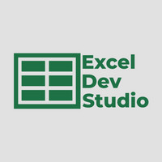

# Microsoft Excel VSTO Introduction
Files from Youtube Introductory course on getting started with VSTO for Microsoft Excel by [Excel Dev Studio](https://www.youtube.com/@exceldevstudio). VSTO stands for Visual Studio Tools for office.  With VSTO we can add new features to extend what Excel can already do.

## Course Outline
1. VSTO Background [(Video 1 of 6)](https://youtu.be/47fZqI5fZ74)
2. Setting Up Environment [(Video 2 of 6)](https://youtu.be/HRSLFgPH5Cw)
3. Excel Solutions [(Video 2 of 6)](https://youtu.be/HRSLFgPH5Cw)
4. Excel Object Model [(Video 3 of 6)](https://youtu.be/u_Ir0eV2Rbk)
5. Ribbon (Video 4 of 6 - Coming soon)
6. Task Pane (Video 5 of 6 - Coming soon)
7. Deployment (Video 6 of 6 - Coming soon)

